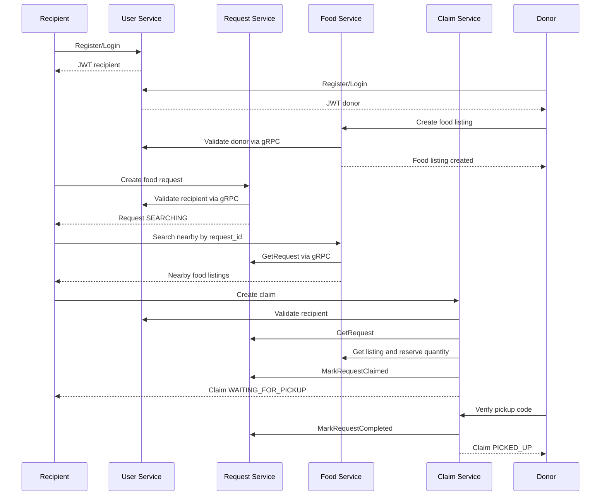
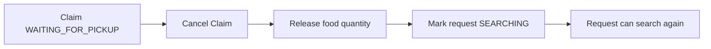

# Zero Hunger end-to-end flow

Cancellation is a compensating flow:

## Ownership

- User Service: authentication, JWT, roles, and user validation.
- Food Service: listings, quantity, nearby matching, reserve/release.
- Request Service: food requests and request status.
- Claim Service: claim lifecycle and pickup verification.
- Contracts: protobuf APIs used between services.

The happy path expects the recipient to create and inspect the claim. Pickup verification is intentionally performed with the donor token because only the donor who owns the listing may confirm the code. The request status progresses `searching` → `claimed` → `completed`; claim status progresses `waiting_for_pickup` → `picked_up`.
